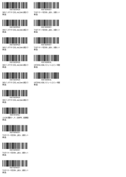
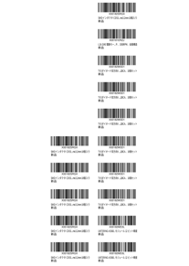
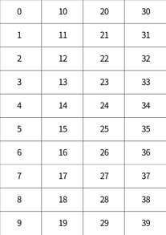

# Amazon Barcode Label Position Changer
Change the SKU barcode positions in PDF file to save label seals

Original | Modified
--- | ---
 | 

A4 40 labels per page  
Index 0-39



## Usage
```
Usage: python main.py <pdf_filename> <print_start_index> <product_count>
Arguments:
  <pdf_filename>: Path to the PDF file to convert to images
  <print_start_index>: Starting index for printing the labels
  <product_count>: Number of labels to print
```

For example, if you used the first 15 label seals, you can use the following command:
```bash
./main.py example.pdf 15 15
```

This will move the barcode of the first 15 labels to index 15-29.